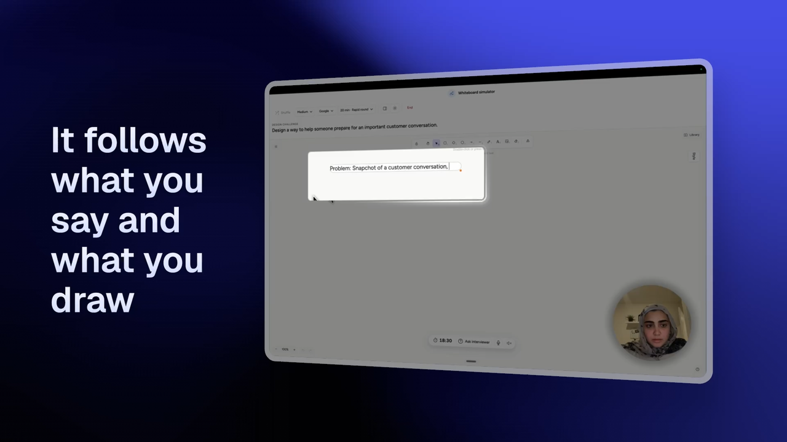

# Whiteboarding Interview Simulator

A voice-first product design whiteboarding simulator for practicing high-stakes design interviews. The candidate works on an Excalidraw canvas while thinking out loud; the AI interviewer listens, asks realistic stakeholder questions, introduces constraints, and produces a rubric-based debrief.

The MVP is tuned for product design, UX, and interaction design whiteboard challenges, with company-aware practice calibration for Google, Meta, Apple, and Netflix.

## Demo

[](docs/media/whiteboard-simulator-demo.mp4)

_Select the preview to watch the full simulator walkthrough._

## What It Does

- Runs a 30-minute whiteboard interview simulation, with a 20-minute express option.
- Starts listening automatically when the session begins.
- Uses OpenAI Realtime over WebRTC for spoken interviewer responses.
- Supports native turn detection and barge-in so the interviewer stops when the candidate speaks.
- Keeps a text fallback when voice or mic access is unavailable.
- Embeds the open-source MIT-licensed Excalidraw board.
- Combines the transcript, an exported Excalidraw PNG, and readable structured scene data in a server-side AI evaluation.
- Shows the newest transcript messages at the top.
- Produces a scannable report card with green dots for strengths and red dots for areas to improve.
- Evaluates reasoning and completeness without judging drawing polish or aesthetics.
- Supports Easy, Medium, and Hard interviewer modes.

## Interviewer Modes

### Easy: Google Core Product Team

A supportive, structured interviewer on an established product team. The interviewer gives a clear prompt, nudges the candidate through the framework, and checks for standard product craft: goals, users, journey, responsive design, accessibility, and ecosystem fit.

### Medium: 0-1 Moonshot Team

A realistic UX lead testing ambiguity tolerance. The candidate is expected to drive the framework without prompting. The interviewer challenges weak assumptions and introduces one technical, privacy, or scope constraint mid-session.

### Hard: Conversational AI and Research Org

A skeptical Senior Staff Designer or UX Director focused on systems, AI uncertainty, trust, latency, accessibility, scale, and tradeoffs. The prompt is intentionally broad, constraints are withheld at first, and severe pivots can appear mid-session.

## Company-Aware Whiteboarding Rubrics

The selected company determines the evaluation emphasis. Each practice profile is based on publicly available product-design interview signals and is not presented as an official internal hiring rubric.

The report evaluates:

- Problem framing and scope
- User focus and insight
- Clarifying questions and assumptions
- Information architecture and journey
- Core solution and interaction flow
- Edge cases, accessibility, and scale
- Tradeoffs, constraints, and rationale
- Communication and design narrative
- Collaboration and adaptability

## Security

Do not put an OpenAI API key in any browser file.

The app is designed so the browser calls `/token`, and the server creates a short-lived Realtime client secret. The actual `OPENAI_API_KEY` stays server-side:

- Local development: `server.mjs`
- Render deployment: `server.mjs`
- Legacy Vercel deployment: `api/token.js`

`.gitignore` excludes `.env`, `.env.local`, `.vercel`, `node_modules`, and local scratch/output folders.

## Local Development

Requirements:

- Node.js 20 or newer
- An OpenAI API key with Realtime API access

Run:

```sh
OPENAI_API_KEY=your_key_here node server.mjs
```

Then open:

```text
http://127.0.0.1:4173/
```

Optional environment variables:

```sh
OPENAI_REALTIME_MODEL=gpt-realtime-2
OPENAI_REALTIME_VOICE=marin
OPENAI_EVALUATION_MODEL=gpt-5-mini
PORT=4173
```

## Deploy To Render

The repository includes a `render.yaml` Blueprint for a Render Node web service.

1. Push the repository to GitHub.
2. In Render, choose **New > Blueprint** and select the repository.
3. Render detects `render.yaml` and creates the `whiteboard-interview-simulator` service.
4. Add the required secret when prompted:

```sh
OPENAI_API_KEY=your_key_here
```

Optional Render environment variables:

```sh
OPENAI_REALTIME_MODEL=gpt-realtime-2
OPENAI_REALTIME_VOICE=marin
OPENAI_EVALUATION_MODEL=gpt-5-mini
```

Render runs `npm run render-build`, starts the app with `npm start`, and checks `/health`. The server binds to Render's `PORT` on `0.0.0.0`.

## Legacy Vercel Deployment

This repo deploys as a static frontend plus one serverless token endpoint.

1. Push the repo to GitHub.
2. Import it into Vercel.
3. Framework preset: `Other`.
4. Build command: leave blank or use `npm run vercel-build`.
5. Output directory: leave blank.
6. Add this environment variable in Vercel Project Settings:

```sh
OPENAI_API_KEY=your_key_here
```

Optional Vercel environment variables:

```sh
OPENAI_REALTIME_MODEL=gpt-realtime-2
OPENAI_REALTIME_VOICE=marin
OPENAI_EVALUATION_MODEL=gpt-5-mini
```

`vercel.json` rewrites `/token` and `/evaluate` to their serverless handlers, so the client works locally and on Vercel without exposing the API key.

## Project Structure

```text
.
├── api/token.js           # Vercel serverless Realtime token endpoint
├── api/evaluate.js        # Vercel serverless evaluation endpoint
├── app.js                 # Main simulator logic and interviewer behavior
├── evaluation.mjs         # Shared server-side evaluation logic and rubric
├── excalidraw-board.js    # Excalidraw mount/bridge
├── index.html             # App shell
├── render.yaml            # Render Blueprint configuration
├── server.mjs             # Render/local static server and API endpoints
├── styles.css             # Material-inspired UI styles
├── vercel.json            # Vercel rewrite and permissions policy
└── package.json           # Deployment metadata
```

## MVP Boundaries

- The prompt bank is curated in `app.js`; it does not claim exhaustive coverage of every company question.
- The interviewer uses transcript, timing, and Excalidraw element context, but does not yet perform full visual image understanding of the canvas.
- Voice critique is based on transcript and interaction behavior; richer audio metrics like pace, hesitation, confidence, and interruption recovery are future work.
- Excalidraw is loaded from a browser module CDN in this MVP. A production build should bundle and self-host it.

## License Notes

Excalidraw is MIT-licensed. This simulator is an MVP prototype and is not affiliated with Google, Excalidraw, OpenAI, or any interview provider.
